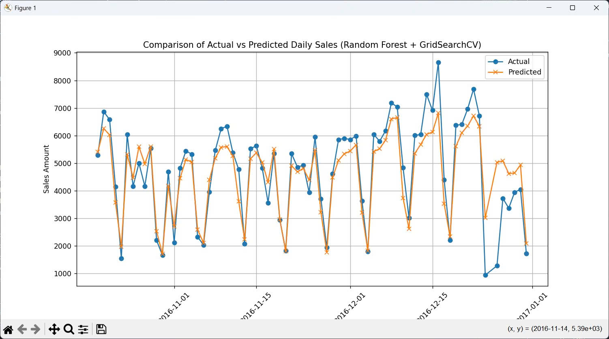

# 📦 Daily Sales Forecasting

**End-to-End Machine Learning Project** for forecasting daily sales revenue using historical sales data.

This project demonstrates real-world skills in:

- 📊 Data Preprocessing & Feature Engineering
- 🔍 Time-Based Feature Extraction (sin/cos encoding, lag features)
- ⚙️ Machine Learning Pipelines with Scikit-learn
- 📉 Model Evaluation & Visualization (RMSE, MAPE, R²)
- 🌐 Model Deployment via Streamlit Web App

---

---
## Actual vs Predicted

---


## 📋 Model Performance

**Random Forest Regressor (Best Parameters from GridSearchCV):**

| Metric   | Value   |
|----------|---------|
| RMSE     | 784.48 |
| MAPE     | 17.58% |
| R² Score |  0.8072 |

---

## 📊 Visual Evaluation

- Actual vs. Predicted Sales (Line Chart)
- 7-Day Rolling Forecast Visualization
- Interactive Date-Based Predictions via Web App

---

## 🎯 Features Engineered

- Day of Week (sin/cos)
- Day of Month, Week of Year
- Lag Features (Previous Day Sales)
- Rolling Means (7-day, 14-day)
- Rolling Standard Deviation
- Growth Rate (% Change)

---

## 📊 Demo

- **Interactive Streamlit Web App**
- Forecast Next 7 Days (rolling predictions)
- Input Future Date for Forecasting
- Visual Comparison of Predictions

---

## 🚀 Run Locally

1️⃣ Clone this repository:
```bash
git clone https://github.com/your-username/sales-forecasting-ml.git
cd sales-forecasting-ml
```

2️⃣ Install required libraries:
```bash
pip install -r requirements.txt
```

3️⃣ Train model:
```bash
python train.py
```

4️⃣ Run Streamlit Web App:
```bash
streamlit run app.py
```

## 🏆 Model Deployed

- 🔗 Random Forest Regressor (`model.pkl`)

---

## ⭐ Acknowledgements

- Dataset Source: Internal / Simulated Sales Data
- Developed as part of personal ML project

---

## 📬 Contact

**Nguyễn Võ Đăng Khoa**  
📧 dangkhoa18205@gmail.com  
🔗 [LinkedIn Profile](https://www.linkedin.com/in/your-profile)
